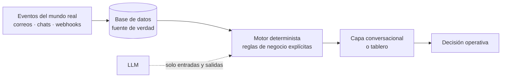

# David Ramos

**Data / AI Engineer.** Construyo sistemas que convierten datos operativos dispersos en decisiones que alguien toma hoy mismo.

Trabajo en logística y reclutamiento de alto volumen: telemetría de flotas, agentes conversacionales y automatización de procesos de RR. HH. Todos mis proyectos nacieron de un problema real de una empresa en operación.

---

## Cómo trabajo

Los tres proyectos comparten la misma estructura, y esa repetición no es casualidad:

**El LLM nunca decide ni consulta libremente.** Aporta comprensión del lenguaje en la entrada y redacción en la salida; las decisiones las toma un motor determinista sobre reglas explícitas y auditables. Un dato inventado en una asignación de viaje o en el perfil de un candidato cuesta dinero real, y "el modelo se equivocó" no es una explicación aceptable para quien opera.

Corolario práctico: las reglas de negocio viven en un solo lugar —normalmente SQL— para que el bot, el tablero y la consulta manual no puedan contradecirse.

## Proyectos

| Proyecto | El problema | Cómo lo resolví | Stack |
|---|---|---|---|
| **[gps-fleet-events](https://github.com/DRAnguiano/gps-fleet-events)** | El proveedor de GPS no daba API: toda pregunta sobre una unidad pasaba por una llamada a Monitoreo, y Tráfico esperaba minutos para asignar un viaje | Convertí el buzón de alertas en el API que no existía: ingesta idempotente con n8n, reglas operativas en vistas SQL, Power BI y un bot de Telegram con RAG local | Python · n8n · PostgreSQL · Ollama · Docker |
| **[driver-recruiting-agent](https://github.com/DRAnguiano/driver-recruiting-agent)** | El reclutador leía conversaciones completas de WhatsApp para saber si un candidato servía | Un agente conversacional que perfila durante el chat y deja un expediente accionable en Chatwoot, con jerarquía de fuentes estricta y sin dejar que el LLM invente datos | FastAPI · LangGraph · Neo4j · Celery · ChromaDB |
| **[recruit-ops-ai](https://github.com/DRAnguiano/recruit-ops-ai)** | Campañas, chats y contrataciones vivían en herramientas separadas, sin trazabilidad entre el gasto en anuncios y el operador contratado | CRM/ATS omnicanal y multiempresa, con atribución de campaña automática, episodios de contratación inmutables y todo el negocio configurable sin código | NestJS · React 19 · PostgreSQL · Redis · Meta API |

## Tecnologías

**Lenguajes** · Python · TypeScript · SQL · JavaScript

**Datos** · PostgreSQL · Neo4j · ChromaDB · Redis · Power BI · modelado dimensional y de eventos

**IA / LLM** · LangGraph · RAG · Ollama (modelos locales) · Groq · Cohere · embeddings y recuperación semántica

**Backend** · FastAPI · NestJS · Celery · BullMQ · APIs REST y WebSocket

**Automatización e infraestructura** · n8n · Docker y Docker Compose · IMAP/webhooks · CI de pruebas

## Qué busco

Posiciones de **Data Engineer o AI Engineer**, presencial en la Comarca Lagunera o en remoto. Me interesan los equipos donde los datos sostienen decisiones operativas y donde la corrección importa más que la novedad del stack.

## Contacto

[LinkedIn](https://www.linkedin.com/in/david-ramos-anguiano-3a647827a/) · david.24000@hotmail.com

